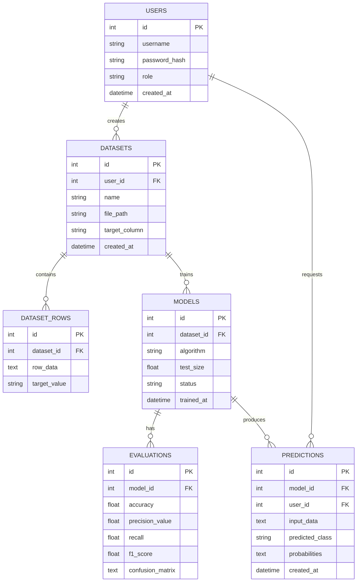

# Entity Relationship Diagram

```mermaid
erDiagram
    USERS ||--o{ DATASETS : creates
    DATASETS ||--o{ DATASET_ROWS : contains
    DATASETS ||--o{ MODELS : trains
    MODELS ||--o{ EVALUATIONS : has
    MODELS ||--o{ PREDICTIONS : produces
    USERS ||--o{ PREDICTIONS : requests

    USERS {
        int id PK
        string username
        string password_hash
        string role
        datetime created_at
    }

    DATASETS {
        int id PK
        int user_id FK
        string name
        string file_path
        string target_column
        datetime created_at
    }

    DATASET_ROWS {
        int id PK
        int dataset_id FK
        text row_data
        string target_value
    }

    MODELS {
        int id PK
        int dataset_id FK
        string algorithm
        float test_size
        string status
        datetime trained_at
    }

    EVALUATIONS {
        int id PK
        int model_id FK
        float accuracy
        float precision_value
        float recall
        float f1_score
        text confusion_matrix
    }

    PREDICTIONS {
        int id PK
        int model_id FK
        int user_id FK
        text input_data
        string predicted_class
        text probabilities
        datetime created_at
    }
```
