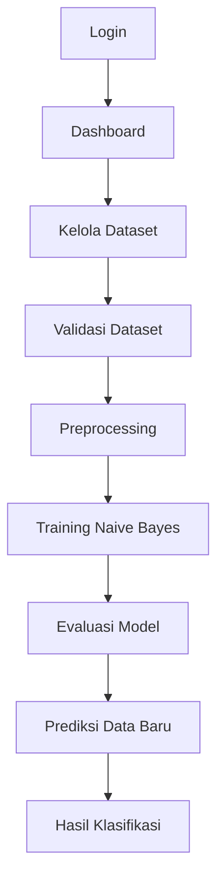

# User Flow

```mermaid
flowchart TD
    A[Login] --> B[Dashboard]
    B --> C[Kelola Dataset]
    C --> D[Validasi Dataset]
    D --> E[Preprocessing]
    E --> F[Training Naive Bayes]
    F --> G[Evaluasi Model]
    G --> H[Prediksi Data Baru]
    H --> I[Hasil Klasifikasi]
```
